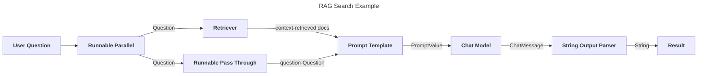

```mermaid
---
title: RAG Search Example
---
flowchart LR
    userQuestion["`**User Question**`"]
    runnableParallel["`**Runnable Parallel**`"]
    retriever["`**Retriever**`"]
    runnablePassThrough["`**Runnable Pass Through**`"]
    promptTemplate["`**Prompt Template**`"]
    chatModel["`**Chat Model**`"]
    strOutputParser["`**String Output Parser**`"]
    result["`**Result**`"]
    userQuestion --> runnableParallel
    runnableParallel -->|Question|retriever
    runnableParallel -->|Question|runnablePassThrough
    retriever -->|context-retrieved docs|promptTemplate
    runnablePassThrough -->|question-Question|promptTemplate
    promptTemplate -->|PromptValue|chatModel
    chatModel -->|ChatMessage|strOutputParser
    strOutputParser -->|String|result
```