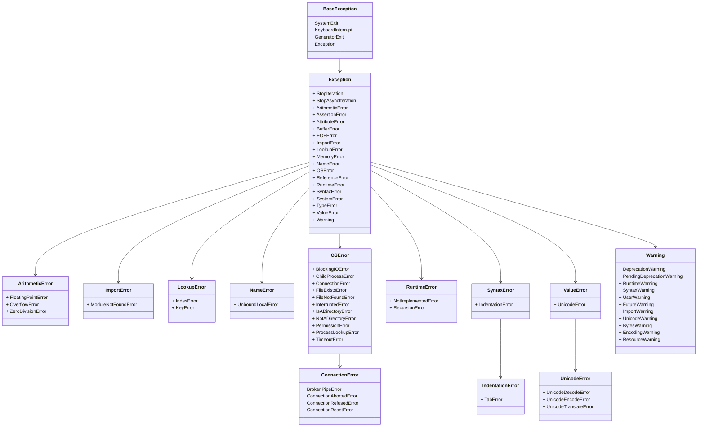

```mermaid
classDiagram
    class BaseException{
        + SystemExit
        + KeyboardInterrupt
        + GeneratorExit
        + Exception
    }
    class Exception{
        + StopIteration
        + StopAsyncIteration
        + ArithmeticError
        + AssertionError
        + AttributeError
        + BufferError
        + EOFError
        + ImportError
        + LookupError
        + MemoryError
        + NameError
        + OSError
        + ReferenceError
        + RuntimeError
        + SyntaxError
        + SystemError
        + TypeError
        + ValueError
        + Warning
    }
    BaseException --> Exception
    class ArithmeticError{
        + FloatingPointError
        + OverflowError
        + ZeroDivisionError
    }
    Exception --> ArithmeticError
    class ImportError{
        + ModuleNotFoundError
    }
    Exception --> ImportError
    class LookupError{
        + IndexError
        + KeyError
    }
    Exception --> LookupError
    class NameError{
        + UnboundLocalError
    }
    Exception --> NameError
    class OSError{
        + BlockingIOError
        + ChildProcessError
        + ConnectionError
        + FileExistsError
        + FileNotFoundError
        + InterruptedError
        + IsADirectoryError
        + NotADirectoryError
        + PermissionError
        + ProcessLookupError
        + TimeoutError
    }
    Exception --> OSError
    class ConnectionError{
        + BrokenPipeError
        + ConnectionAbortedError
        + ConnectionRefusedError
        + ConnectionResetError
    }
    OSError --> ConnectionError
    class RuntimeError{
        + NotImplementedError
        + RecursionError
    }
    Exception --> RuntimeError
    class SyntaxError {
        + IndentationError
    }
    Exception --> SyntaxError
    class IndentationError {
        + TabError
    }
    SyntaxError --> IndentationError
    class ValueError{
        + UnicodeError
    }
    Exception --> ValueError
    class UnicodeError{
        + UnicodeDecodeError
        + UnicodeEncodeError
        + UnicodeTranslateError
    }
    ValueError --> UnicodeError
    class Warning{
        + DeprecationWarning
        + PendingDeprecationWarning
        + RuntimeWarning
        + SyntaxWarning
        + UserWarning
        + FutureWarning
        + ImportWarning
        + UnicodeWarning
        + BytesWarning
        + EncodingWarning
        + ResourceWarning
    }
    Exception --> Warning
```