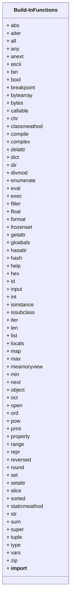

```mermaid
classDiagram
    class Build-In Functions{
        + abs
        + aiter
        + all
        + any
        + anext
        + ascii
        + bin
        + bool
        + breakpoint
        + bytearray
        + bytes
        + callable
        + chr
        + classmeathod
        + compile
        + complex
        + delattr
        + dict
        + dir
        + divmod
        + enumerate
        + eval
        + exec
        + filter
        + float
        + format
        + frozenset
        + getattr
        + gloabals
        + hasattr
        + hash
        + help
        + hex
        + id
        + input
        + int
        + isinstance
        + issubclass
        + iter
        + len
        + list
        + locals
        + map
        + max
        + meamoryview
        + min
        + next
        + object
        + oct
        + open
        + ord
        + pow
        + print
        + property
        + range
        + repr
        + reversed
        + round
        + set
        + setattr
        + slice
        + sorted
        + staticmeathod
        + str
        + sum
        + super
        + tuple
        + type
        + vars
        + zip
        + __import__
    }
```