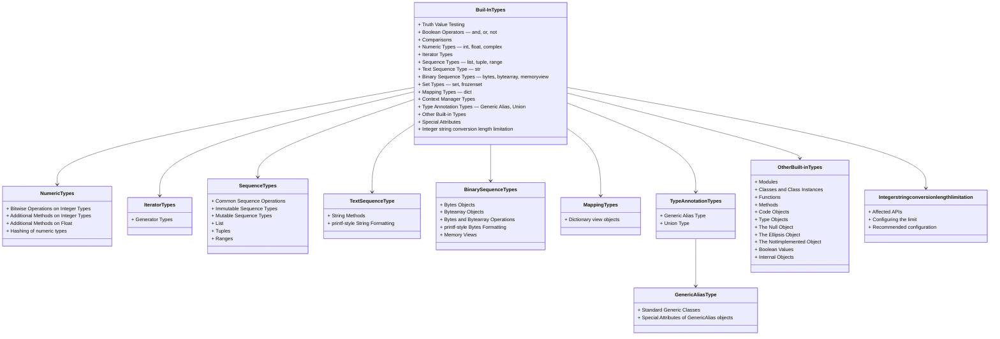

```mermaid
classDiagram
    class Buil-In Types{
        + Truth Value Testing
        + Boolean Operators — and, or, not
        + Comparisons
        + Numeric Types — int, float, complex
        + Iterator Types
        + Sequence Types — list, tuple, range
        + Text Sequence Type — str
        + Binary Sequence Types — bytes, bytearray, memoryview
        + Set Types — set, frozenset
        + Mapping Types — dict
        + Context Manager Types
        + Type Annotation Types — Generic Alias, Union
        + Other Built-in Types
        + Special Attributes
        + Integer string conversion length limitation
    }
    class Numeric Types{
        + Bitwise Operations on Integer Types
        + Additional Methods on Integer Types
        + Additional Methods on Float
        + Hashing of numeric types
    }
    Buil-In Types --> Numeric Types
    class Iterator Types{
        + Generator Types
    }
    Buil-In Types --> Iterator Types
    class Sequence Types{
        + Common Sequence Operations
        + Immutable Sequence Types
        + Mutable Sequence Types
        + List
        + Tuples
        + Ranges
    }
    Buil-In Types --> Sequence Types
    class Text Sequence Type{
        + String Methods
        + printf-style String Formatting
    }
    Buil-In Types --> Text Sequence Type
    class Binary Sequence Types{
        + Bytes Objects
        + Bytearray Objects
        + Bytes and Bytearray Operations
        + printf-style Bytes Formatting
        + Memory Views
    }
    Buil-In Types --> Binary Sequence Types
    class Mapping Types{
        + Dictionary view objects
    }
    Buil-In Types --> Mapping Types
    class Type Annotation Types{
        + Generic Alias Type
        + Union Type
    }
    Buil-In Types --> Type Annotation Types
    class Generic Alias Type{
        + Standard Generic Classes
        + Special Attributes of GenericAlias objects
    }
    Type Annotation Types --> Generic Alias Type
    class Other Built-in Types{
        + Modules
        + Classes and Class Instances
        + Functions
        + Methods
        + Code Objects
        + Type Objects
        + The Null Object
        + The Ellipsis Object
        + The NotImplemented Object
        + Boolean Values
        + Internal Objects
    }
    Buil-In Types --> Other Built-in Types
    class Integer string conversion length limitation {
        + Affected APIs
        + Configuring the limit
        + Recommended configuration
    }
    Buil-In Types --> Integer string conversion length limitation
```