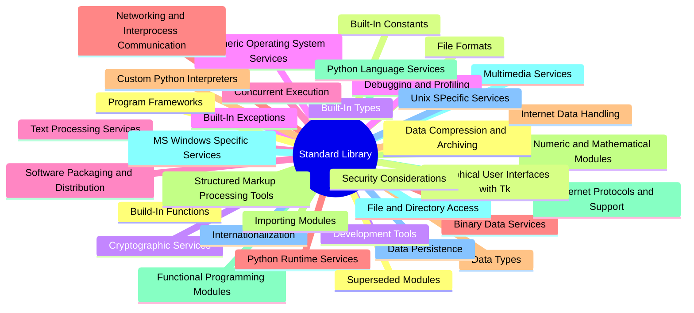

```mermaid
mindmap
  root((Standard Library))
    Build-In Functions
    Built-In Constants
    Built-In Types
    Built-In Exceptions
    Text Processing Services
    Binary Data Services
    Data Types
    Numeric and Mathematical Modules
    Functional Programming Modules
    File and Directory Access
    Data Persistence
    Data Compression and Archiving
    File Formats
    Cryptographic Services
    Generic Operating System Services
    Concurrent Execution
    Networking and Interprocess Communication
    Internet Data Handling
    Structured Markup Processing Tools
    Internet Protocols and Support
    Multimedia Services
    Internationalization
    Program Frameworks
    Graphical User Interfaces with Tk
    Development Tools
    Debugging and Profiling
    Software Packaging and Distribution
    Python Runtime Services
    Custom Python Interpreters
    Importing Modules
    Python Language Services
    MS Windows Specific Services
    Unix SPecific Services
    Superseded Modules
    Security Considerations
```