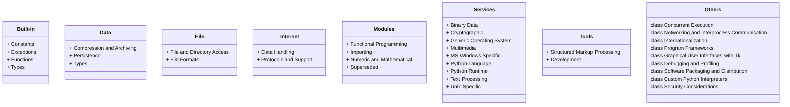

```mermaid
classDiagram
    class Built-In{
        + Constants
        + Exceptions
        + Functions
        + Types
    }
    class Data{
        + Compression and Archiving
        + Persistence
        + Types
    }
    class File{
        + File and Directory Access
        + File Formats
    }
    class Internet {
        + Data Handling
        + Protocols and Support
    }
    class Modules{
        + Functional Programming
        + Importing
        + Numeric and Mathematical
        + Superseded
    }
    class Services{
        + Binary Data
        + Cryptographic
        + Generic Operating System
        + Multimedia
        + MS Windows Specific
        + Python Language
        + Python Runtime
        + Text Processing
        + Unix Specific
    }
    class Tools {
        + Structured Markup Processing
        + Development
    }
    class Others{
        class Concurrent Execution
        class Networking and Interprocess Communication
        class Internationalization
        class Program Frameworks
        class Graphical User Interfaces with Tk
        class Debugging and Profiling
        class Software Packaging and Distribution
        class Custom Python Interpreters
        class Security Considerations
    }
```